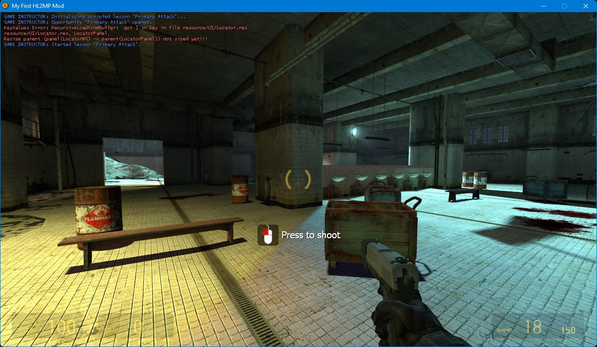

# Game Instructor

This repository contains the code and assets needed to add the Source Engine Alien Swarm game instructor to the Source SDK 2013.

## ⭐ About

The Game Instructor is a clientside system in charge of showing instructions on how to play or perform certain actions during gameplay. It made its first appearance in the Left 4 Dead branch of the engine and has been featured in all major Valve titles since then.


## 👨‍💻 Installation

1. Add the files from the `src` folder to your mod code.
2. Add the files from the `game` folder to the files/assets of your mod, if these files already exist it is **highly recommended to merge rather than replace**.
3. Apply the [fixes](#-fixes) to your mod code.
4. Optional but recommended, add the contents of `game/instructor.fgd` to the fgd of your mod to trigger lessons from the map editor.

## ➕ Adding lessons

Lessons should be added in `game/scripts/instructor_lessons.txt`. 

The current file has an example lesson to show the button that has to be pressed to fire a weapon:

```
"Primary Attack"
{
  "instance_type"    "2"
  "caption"          "Press to shoot"

  "onscreen_icon"    "use_binding"
  "offscreen_icon"   "icon_info"
  "binding"          "+attack"

  "success_limit"    "2"
  "timeout"          "8"

  "open"
  {
    // Open when the code fires this event.
    // Example: Player has picked up a weapon.
    "instructor_primaryattack"
    {
      "local_player is"   "player userid"
      "icon_target set"   "player local_player"
    }
  }

  "success"
  {
    // Tutorial successfully completed when the code fires this event.
    // Example: Player has pressed the primary mouse button.
    "use_primaryattack"
    {
      "local_player is"   "player userid"
      "void close"        "void"
    }
  }
}
```

Since there is no documentation on how to create lessons it is recommended to see the `instructor_lessons.txt` of Left 4 Dead and Alien Swarm.

## ⚠️ Triggering lessons

The easiest way is to use the `env_instructor_hint` entity in Hammer, from there you can configure in a user friendly way the icon, text and other basic options.

For more advanced things it will be necessary to use events triggered from the code. The example above (on how to fire a weapon) uses the `instructor_primaryattack` event to display the lesson and the `use_primaryattack` event to set it as completed.

Events must be added to `game/resource/modevents.res` before they can be used in code.

Now you can launch the event with the following code:

```c++
IGameEvent *pEvent = gameeventmanager->CreateEvent("instructor_primaryattack");

if (pEvent)
{
    pEvent->SetInt("userid", GetUserID());
    gameeventmanager->FireEvent(pEvent);
}
```
You can get more information about [creating events here](https://developer.valvesoftware.com/wiki/Networking_Events_%26_Messages).



## 🔧 Fixes

For the repository code to work you need to make some changes to the existing code of your mod:

### `game/shared/util_shared.cpp`

Look for `UTIL_StringFieldToInt` and under it add the following:

```c++
static char s_NumBitsInNibble[ 16 ] = 
{
	0, // 0000 = 0
	1, // 0001 = 1
	1, // 0010 = 2
	2, // 0011 = 3
	1, // 0100 = 4
	2, // 0101 = 5
	2, // 0110 = 6
	3, // 0111 = 7
	1, // 1000 = 8
	2, // 1001 = 9
	2, // 1010 = 10
	3, // 1011 = 11
	2, // 1100 = 12
	3, // 1101 = 13
	3, // 1110 = 14
	4, // 1111 = 15
};

int UTIL_CountNumBitsSet( unsigned int nVar )
{
	int nNumBits = 0;

	while ( nVar > 0 )
	{
		// Look up and add in bits in the bottom nibble
		nNumBits += s_NumBitsInNibble[ nVar & 0x0f ];

		// Shift one nibble to the right
		nVar >>= 4;
	}

	return nNumBits;
}

int UTIL_CountNumBitsSet( uint64 nVar )
{
	int nNumBits = 0;

	while ( nVar > 0 )
	{
		// Look up and add in bits in the bottom nibble
		nNumBits += s_NumBitsInNibble[ nVar & 0x0f ];

		// Shift one nibble to the right
		nVar >>= 4;
	}

	return nNumBits;
}
```

---

### `game/shared/util_shared.h`

Look for `UTIL_StringFieldToInt` and under it add the following:

```c++
int UTIL_CountNumBitsSet( unsigned int nVar );
int UTIL_CountNumBitsSet( uint64 nVar );
```

---

### `game/client/c_baseentity.h`

Look for `GetDebugName` and under it add the following:

```c++
virtual const char *GetPlayerName() const { return NULL; }
```

---

### ` game/client/hud.h`

Look for `extern CHud gHUD;` and under it add the following:

```c++
//-----------------------------------------------------------------------------
// Purpose: CHudIcons
//-----------------------------------------------------------------------------
class CHudIcons
{
public:
	CHudIcons();
	~CHudIcons();

	void						Init();
	void						Shutdown();

	CHudTexture					*GetIcon( const char *szIcon );

	// loads a new icon into the list, without duplicates
	CHudTexture					*AddUnsearchableHudIconToList( CHudTexture& texture );
	CHudTexture					*AddSearchableHudIconToList( CHudTexture& texture );

	void						RefreshHudTextures();

private:

	void						SetupNewHudTexture( CHudTexture *t );
	bool						m_bHudTexturesLoaded;
	// Global list of known icons
	CUtlDict< CHudTexture *, int >		m_Icons;

};

CHudIcons &HudIcons();
```

---

### `game/client/hud.cpp`

At the end of the file add:

```c++
CHudIcons::CHudIcons() :
	m_bHudTexturesLoaded( false )
{
}

CHudIcons::~CHudIcons()
{
	int c = m_Icons.Count();
	for ( int i = c - 1; i >= 0; i-- )
	{
		CHudTexture *tex = m_Icons[ i ];
		g_HudTextureMemoryPool.Free( tex );
	}
	m_Icons.Purge();
}

void CHudIcons::Init()
{
	if ( m_bHudTexturesLoaded )
		return;

	m_bHudTexturesLoaded = true;
	CUtlDict< CHudTexture *, int >	textureList;

	// check to see if we have sprites for this res; if not, step down
	LoadHudTextures( textureList, "scripts/hud_textures", NULL );
	LoadHudTextures( textureList, "scripts/mod_textures", NULL );

	LoadHudTextures( textureList, "scripts/instructor_textures", NULL );
	LoadHudTextures( textureList, "scripts/instructor_modtextures", NULL );

	int c = textureList.Count();
	for ( int index = 0; index < c; index++ )
	{
		CHudTexture* tex = textureList[ index ];
		AddSearchableHudIconToList( *tex );
	}

	FreeHudTextureList( textureList );
}

void CHudIcons::Shutdown()
{
	m_bHudTexturesLoaded = false;
}

//-----------------------------------------------------------------------------
// Purpose: 
//-----------------------------------------------------------------------------
CHudTexture *CHudIcons::AddUnsearchableHudIconToList( CHudTexture& texture )
{
	// These names are composed based on the texture file name
	char composedName[ 512 ];

	if ( texture.bRenderUsingFont )
	{
		Q_snprintf( composedName, sizeof( composedName ), "%s_c%i",
			texture.szTextureFile, texture.cCharacterInFont );
	}
	else
	{
		Q_snprintf( composedName, sizeof( composedName ), "%s_%i_%i_%i_%i",
			texture.szTextureFile, texture.rc.left, texture.rc.top, texture.rc.right, texture.rc.bottom );
	}

	CHudTexture *icon = GetIcon( composedName );
	if ( icon )
	{
		return icon;
	}

	CHudTexture *newTexture = ( CHudTexture * )g_HudTextureMemoryPool.Alloc();
	*newTexture = texture;

	SetupNewHudTexture( newTexture );

	int idx = m_Icons.Insert( composedName, newTexture );
	return m_Icons[ idx ];
}

//-----------------------------------------------------------------------------
// Purpose: 
//-----------------------------------------------------------------------------
CHudTexture *CHudIcons::AddSearchableHudIconToList( CHudTexture& texture )
{
	CHudTexture *icon = GetIcon( texture.szShortName );
	if ( icon )
	{
		return icon;
	}

	CHudTexture *newTexture = ( CHudTexture * )g_HudTextureMemoryPool.Alloc();
	*newTexture = texture;

	SetupNewHudTexture( newTexture );

	int idx = m_Icons.Insert( texture.szShortName, newTexture );
	return m_Icons[ idx ];
}

//-----------------------------------------------------------------------------
// Purpose: returns a pointer to an icon in the list
//-----------------------------------------------------------------------------
CHudTexture *CHudIcons::GetIcon( const char *szIcon )
{
	int i = m_Icons.Find( szIcon );
	if ( i == m_Icons.InvalidIndex() )
		return NULL;

	return m_Icons[ i ];
}

//-----------------------------------------------------------------------------
// Purpose: Gets texture handles for the hud icon
//-----------------------------------------------------------------------------
void CHudIcons::SetupNewHudTexture( CHudTexture *t )
{
	if ( t->bRenderUsingFont )
	{
		vgui::HScheme scheme = vgui::scheme()->GetScheme( "ClientScheme" );
		t->hFont = vgui::scheme()->GetIScheme(scheme)->GetFont( t->szTextureFile, true );
		t->rc.top = 0;
		t->rc.left = 0;
		t->rc.right = vgui::surface()->GetCharacterWidth( t->hFont, t->cCharacterInFont );
		t->rc.bottom = vgui::surface()->GetFontTall( t->hFont );
	}
	else
	{
		// Set up texture id and texture coordinates
		t->textureId = vgui::surface()->CreateNewTextureID();
		vgui::surface()->DrawSetTextureFile( t->textureId, t->szTextureFile, false, false );

		int wide, tall;
		vgui::surface()->DrawGetTextureSize( t->textureId, wide, tall );

		t->texCoords[ 0 ] = (float)(t->rc.left + 0.5f) / (float)wide;
		t->texCoords[ 1 ] = (float)(t->rc.top + 0.5f) / (float)tall;
		t->texCoords[ 2 ] = (float)(t->rc.right - 0.5f) / (float)wide;
		t->texCoords[ 3 ] = (float)(t->rc.bottom - 0.5f) / (float)tall;
	}
}

//-----------------------------------------------------------------------------
// Purpose: 
//-----------------------------------------------------------------------------
void CHudIcons::RefreshHudTextures()
{
	if ( !m_bHudTexturesLoaded )
	{
		Assert( 0 );
		return;
	}

	CUtlDict< CHudTexture *, int >	textureList;

	// check to see if we have sprites for this res; if not, step down
	LoadHudTextures( textureList, "scripts/hud_textures", NULL );
	LoadHudTextures( textureList, "scripts/mod_textures", NULL );

	LoadHudTextures( textureList, "scripts/instructor_textures", NULL );
  LoadHudTextures( textureList, "scripts/instructor_modtextures", NULL );

	// fix up all the texture icons first
	int c = textureList.Count();
	for ( int index = 0; index < c; index++ )
	{
		CHudTexture *tex = textureList[ index ];
		Assert( tex );

		CHudTexture *icon = GetIcon( tex->szShortName );
		if ( !icon )
			continue;

		// Update file
		Q_strncpy( icon->szTextureFile, tex->szTextureFile, sizeof( icon->szTextureFile ) );

		if ( !icon->bRenderUsingFont )
		{
			// Update subrect
			icon->rc = tex->rc;

			// Keep existing texture id, but now update texture file and texture coordinates
			vgui::surface()->DrawSetTextureFile( icon->textureId, icon->szTextureFile, false, false );

			// Get new texture dimensions in case it changed
			int wide, tall;
			vgui::surface()->DrawGetTextureSize( icon->textureId, wide, tall );

			// Assign coords
			icon->texCoords[ 0 ] = (float)(icon->rc.left + 0.5f) / (float)wide;
			icon->texCoords[ 1 ] = (float)(icon->rc.top + 0.5f) / (float)tall;
			icon->texCoords[ 2 ] = (float)(icon->rc.right - 0.5f) / (float)wide;
			icon->texCoords[ 3 ] = (float)(icon->rc.bottom - 0.5f) / (float)tall;
		}
	}

	FreeHudTextureList( textureList );

	// fixup all the font icons
	vgui::HScheme scheme = vgui::scheme()->GetScheme( "ClientScheme" );
	for (int i = m_Icons.First(); m_Icons.IsValidIndex(i); i = m_Icons.Next(i))
	{
		CHudTexture *icon = m_Icons[i];
		if ( !icon )
			continue;

		// Update file
		if ( icon->bRenderUsingFont )
		{
			icon->hFont = vgui::scheme()->GetIScheme(scheme)->GetFont( icon->szTextureFile, true );
			icon->rc.top = 0;
			icon->rc.left = 0;
			icon->rc.right = vgui::surface()->GetCharacterWidth( icon->hFont, icon->cCharacterInFont );
			icon->rc.bottom = vgui::surface()->GetFontTall( icon->hFont );
		}
	}
}


static CHudIcons g_HudIcons;

CHudIcons &HudIcons()
{
	return g_HudIcons;
}
```

In the same file, look for the function `CHud::Init` and inside at the end add:

```c++
HudIcons().Init();
```

---

### `public/tier1/convar.h`

Look for `GetInt( void ) const;` and under it add the following:

```c++
FORCEINLINE_CVAR Color GetColor( void ) const;
```

In the same file, look for:

```
//-----------------------------------------------------------------------------
// Purpose: Return ConVar value as an int
// Output : int
//-----------------------------------------------------------------------------
FORCEINLINE_CVAR int ConVar::GetInt( void ) const 
{
	return m_pParent->m_nValue;
}
```

and under it add the following:

```c++
//-----------------------------------------------------------------------------
// Purpose: Return ConVar value as a color
// Output : Color
//-----------------------------------------------------------------------------
FORCEINLINE_CVAR Color ConVar::GetColor( void ) const 
{
	unsigned char *pColorElement = ((unsigned char *)&m_pParent->m_nValue);
	return Color( pColorElement[0], pColorElement[1], pColorElement[2], pColorElement[3] );
}
```

To finish, add the following below the `#include` at the beginning of the file:

```c++
#include "color.h"
```